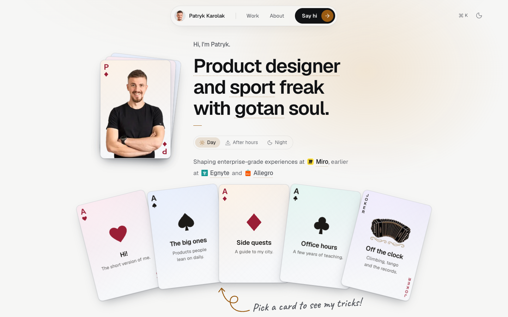

# Product Designer Portfolio

A portfolio template for a product designer: six case studies at teaser depth, password-gated, built with Next.js 16 and deployed on Vercel. Anyone gets each case's bottom line in about 30 seconds; the full story is told in person.

**Status:** v1 with Patryk Karolak's real cases from Miro, Allegro and Egnyte, all password protected (ADR 0034). See [docs/progress.md](docs/progress.md).



## Quick start

```bash
pnpm install
cp .env.example .env.local   # set CASE_PASSWORD and AUTH_SECRET
pnpm dev
```

Open http://localhost:3000. All six cases are protected; unlock them with your `CASE_PASSWORD`.

## Make it yours

- **Content:** edit `content/site.ts` and the four files in `content/projects/`, then swap the images in `public/`. The build enforces the reading budgets. Guide: [docs/content-guide.md](docs/content-guide.md).
- **Design language:** the whole look lives in `themes/blueprint/`. Fork it with `pnpm theme:new <name>`, change it, switch with `pnpm theme:use <name>`. Guide: [docs/theming.md](docs/theming.md).
- **Deploy:** import the repo in Vercel, add the two env vars, add the Firewall rate limit. Guide: [docs/operations.md](docs/operations.md).

## Password gate: honest limit

One shared password unlocks the protected cases for 30 days. It keeps the case content out of public view and search engines. It is **not** strong security: anyone with the password can share it. Details: [ADR 0004](docs/decisions/0004-password-gating.md).

## Docs

- [docs/README.md](docs/README.md): documentation hub.
- [DESIGN.md](DESIGN.md): the Blueprint design system.
- [AGENTS.md](AGENTS.md): instructions for coding agents working on this repo.
