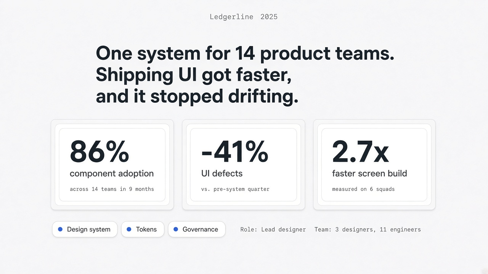
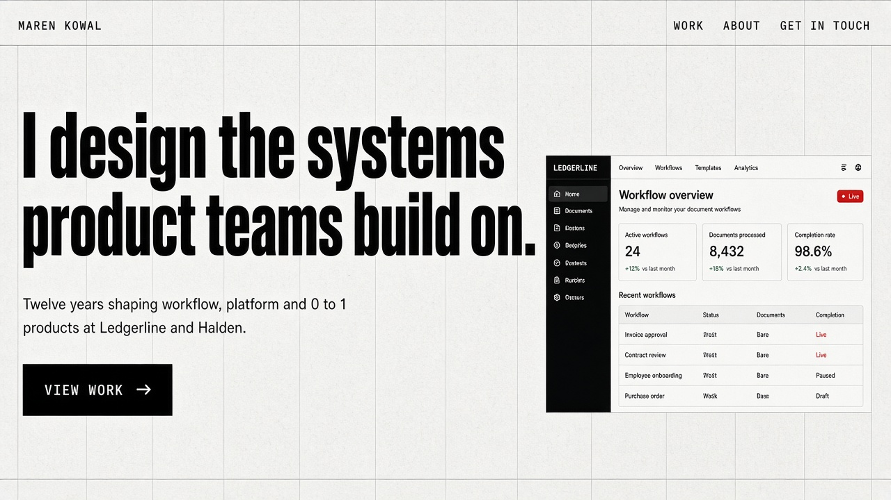
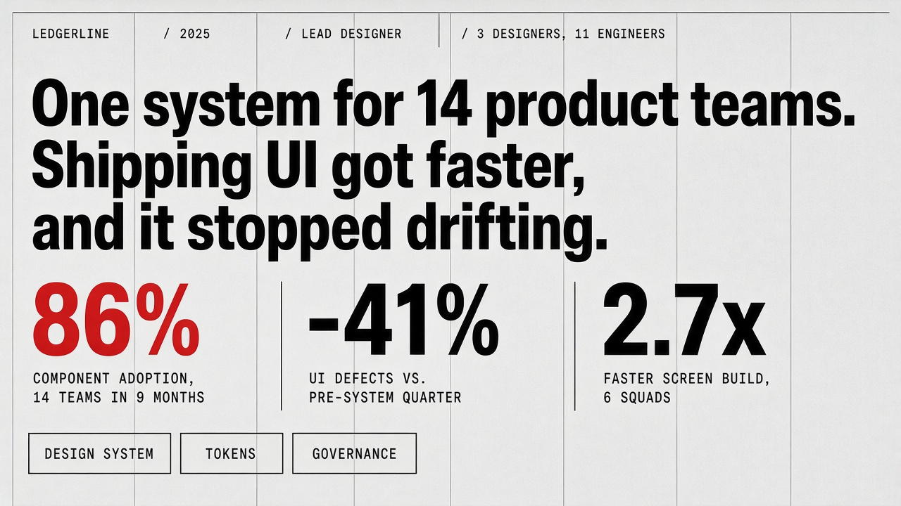
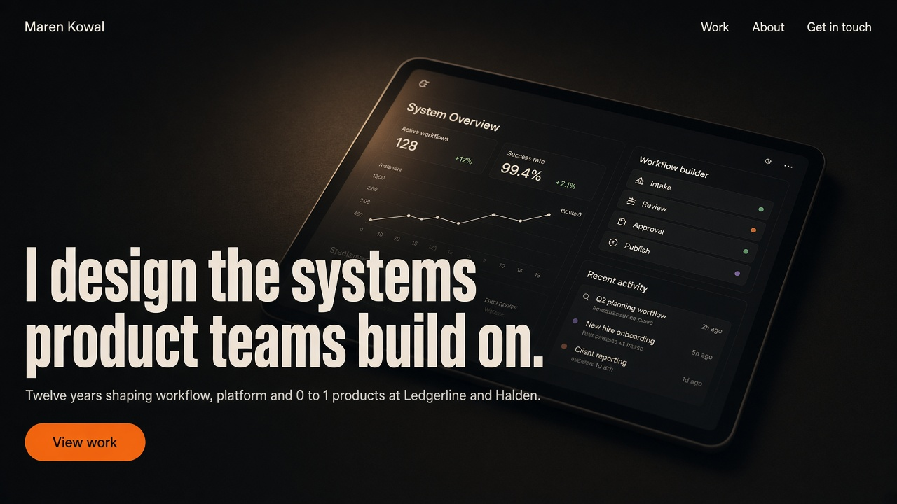
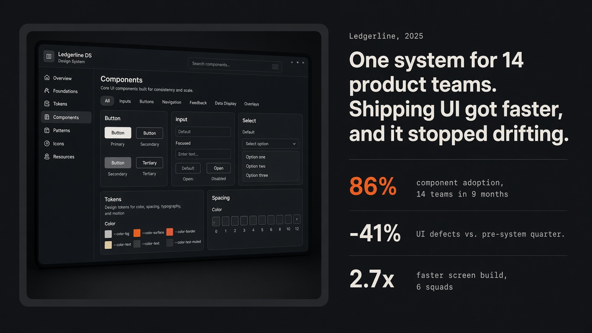
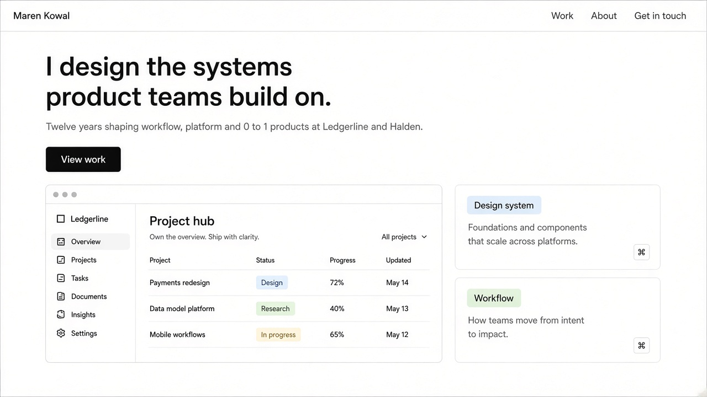
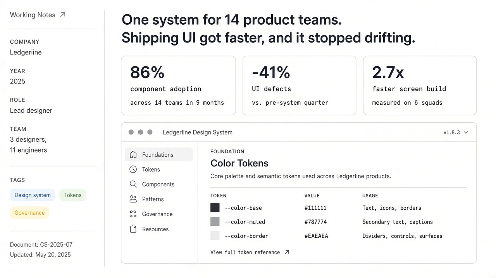
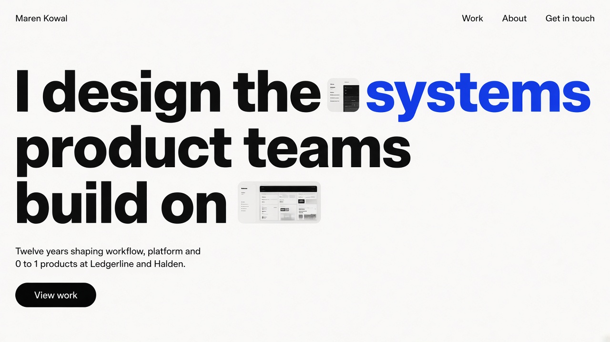
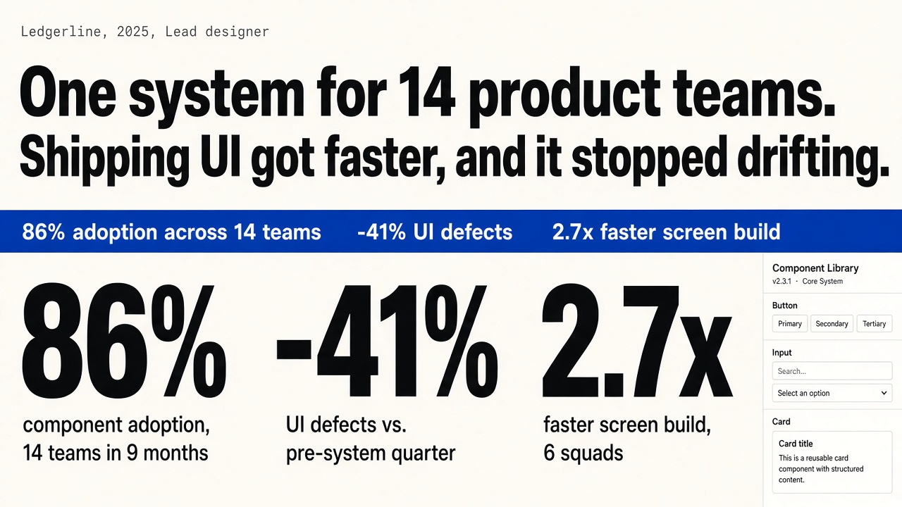

# Phase 0, round 1: Style directions (rejected)

**Outcome:** the user rejected all five and asked for cleaner, more modern concepts with generous whitespace, subtle gradients and a subtle isometric grid in the backgrounds. That became [round 2](../round-2/README.md).

Five concepts, each with 2 sections: the home hero and a case study metrics block. They were generated with the `imagegen-frontend-web` skill on 2026-09-30. All five use the same placeholder designer (Maren Kowal) and the same case (Ledgerline design system), so only the style differs. The full specs are in [../../../docs/plan.md](../../../docs/plan.md), section "Phase 0". The pick and the reasoning are recorded in ADR 0002.

Text inside the mock UI screenshots is sometimes garbled. That is expected from image generation and irrelevant here, because real artifacts replace them.

## A. Quiet Precision

- Calm and expensive; the double-bezel metric cards read as crafted objects.
- Risk: the most familiar look of the five, and it leans on strong artifacts.

## B. Swiss Systems

- The strongest typographic presence. On the metrics page, the numbers do the talking.
- The visible grid signals rigor and systems thinking.
- The generator rendered the display type as a condensed grotesk; a heavy condensed face (for example Anton or Archivo Narrow Black) would match it.
- Risk: austere.

## C. Studio Night

- The most cinematic and "cool"; media-led.
- The metrics split, with the artifact on the left and numbers on the right, works well as a pinned scroll chapter.
- Risk: dark UI artifacts lose contrast, and it is the heaviest on mobile.

## D. Working Notes

- The most legible to any audience; the case page reads like a well-made spec.
- Risk: the hero has the least drama of the five.

## E. Signal

- The most memorable hero; the inline image pills give it a point of view.
- The gigantic numerals are very strong.
- Note: the marquee repeats the metrics directly below it. If E is picked, the marquee moves to the home page or is dropped.
- Risk: personality-forward.
