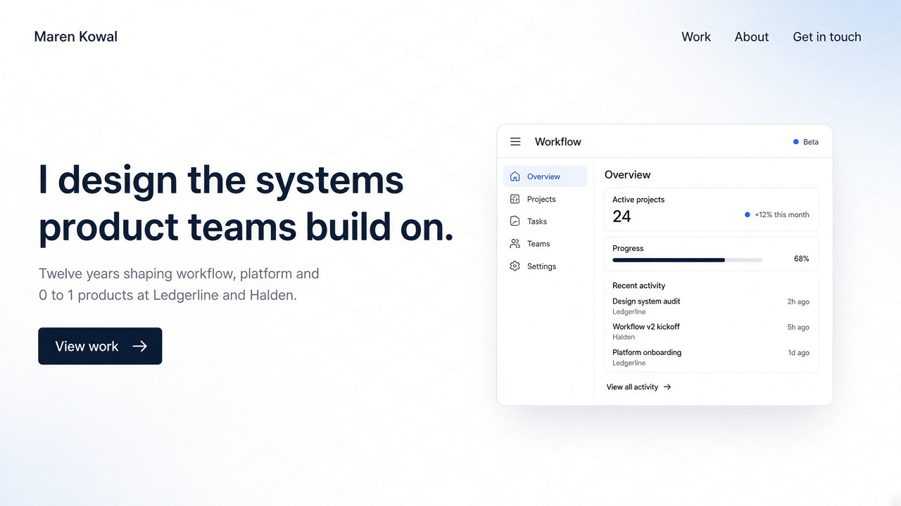
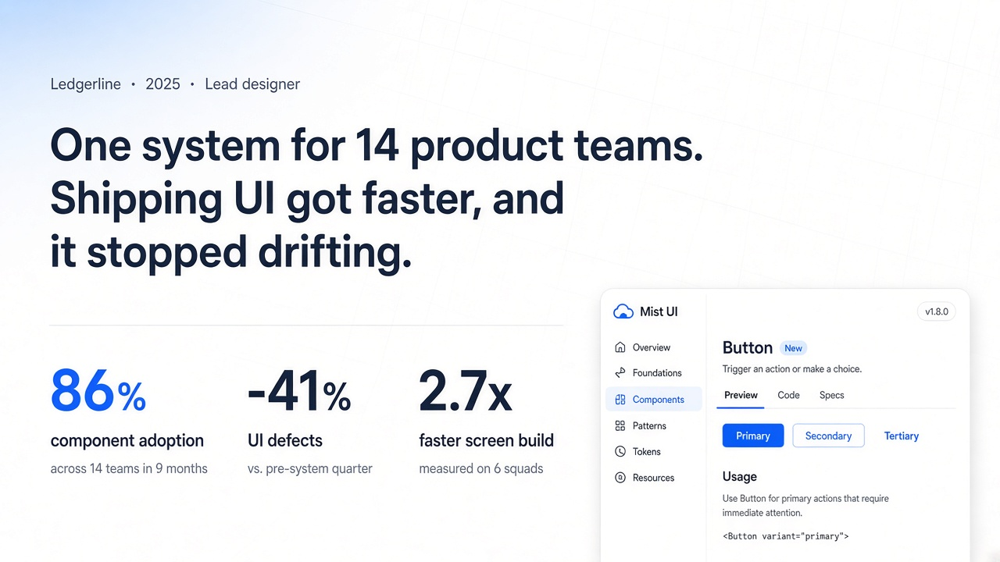
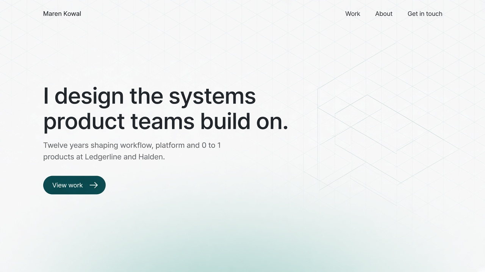
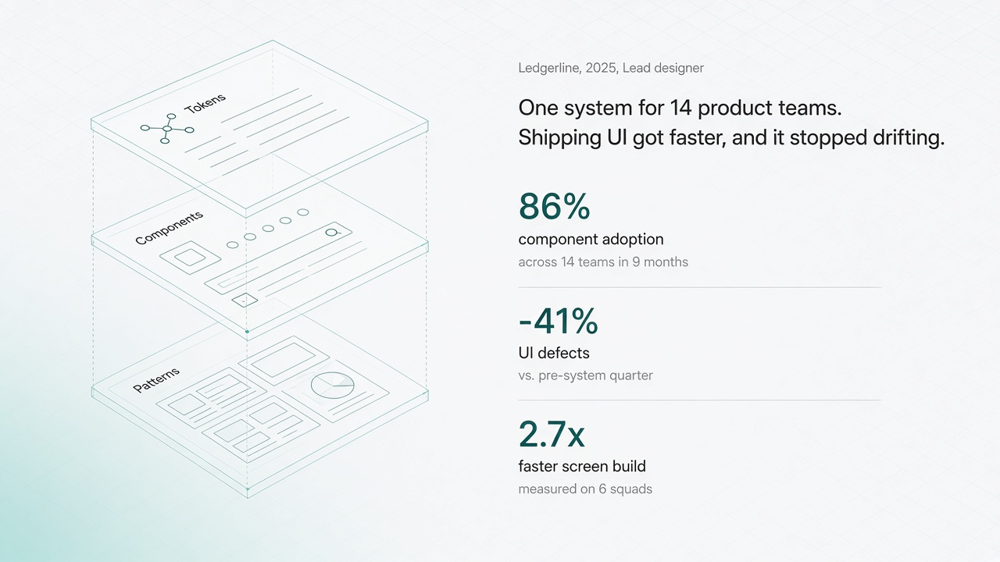
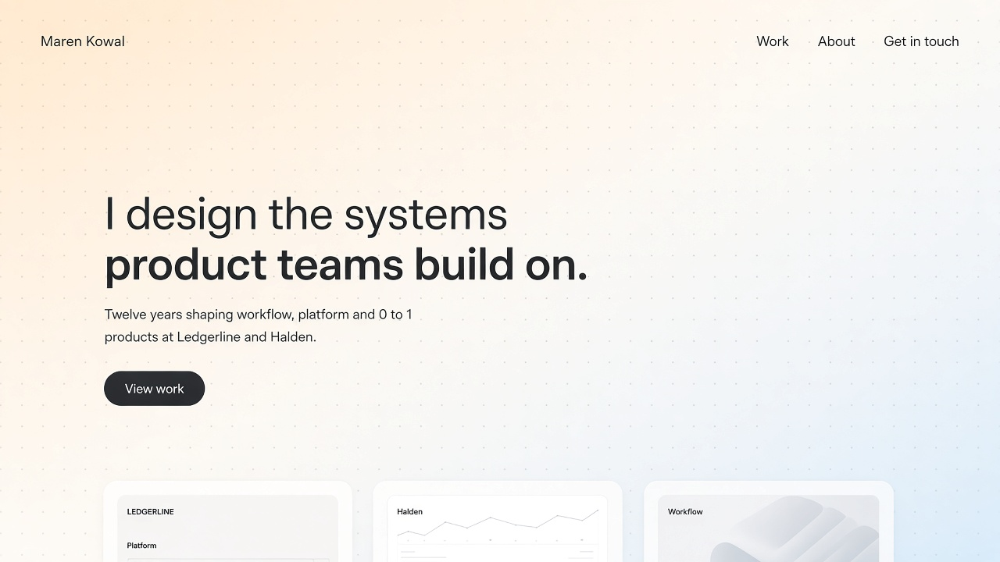
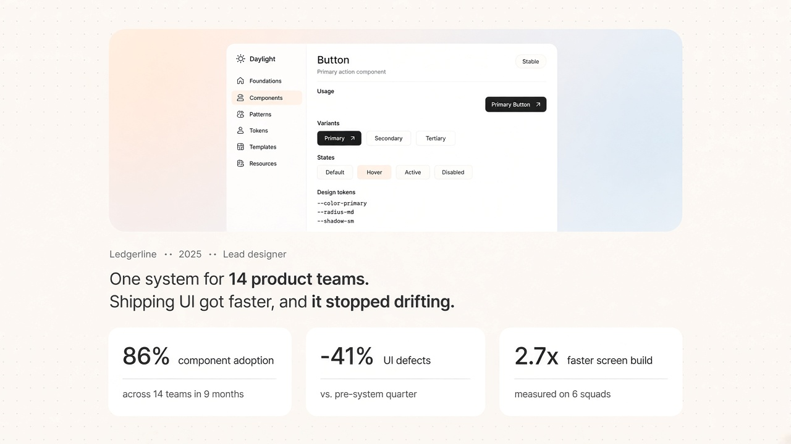
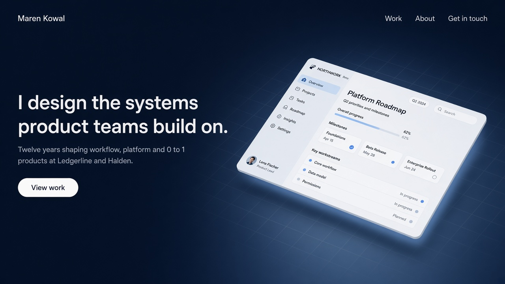
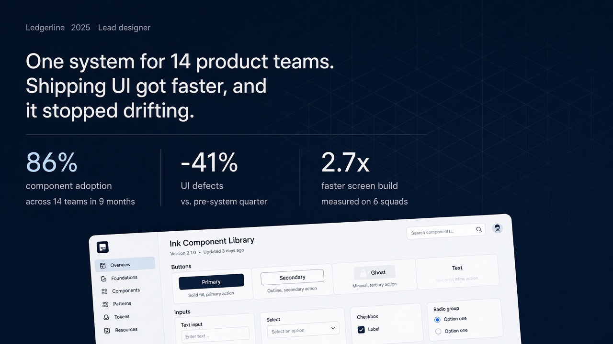

# Phase 0, round 2: Style directions

**Brief from the user, after [round 1](../round-1/README.md) was rejected:** clean and modern, beautiful whitespace, subtle gradients, subtle isometric grids in the backgrounds.

**Shared by all four:** a faint isometric grid behind the content that fades out toward the edges, one soft gradient glow per view, very generous whitespace, one accent color, and the same placeholder content as round 1. These concepts show the old placeholder name, Maren Kowal; from `section-refs` on, the name is Patryk Karolak. Generated 2026-09-30 with `imagegen-frontend-web`.

Text inside the mock UI screenshots is sometimes garbled. That is expected from image generation and irrelevant here, because real artifacts replace them.

## F. Mist

- **Look:** white with a pale sky-blue glow, a light grey isometric line grid, a slate text palette and a cobalt accent. Type is Geist semibold.
- **Signals:** the cleanest and most "modern product company."
- **Metrics:** the numbers sit on hairlines with no cards, so the numbers breathe.
- **Risk:** the most expected look of the four.

## G. Blueprint

- **Look:** a cool grey-white page with a mint-teal haze rising from below, a teal isometric grid and a deep teal accent. Type would be Satoshi (the render drifted toward a neutral grotesk).
- **Signature:** isometric line drawings, such as the exploded "Tokens, Components, Patterns" layer stack. This makes the isometric grid part of the story, not just decoration. It says "systems thinker" without saying it.
- **Risk:** the illustrations need to be made per case (as SVG).

## H. Daylight

- **Look:** near-white with a very soft apricot-to-sky diagonal wash, an isometric dot grid and a graphite palette with no strong accent. Type is General Sans, with light and semibold weights mixed in the headline.
- **Signals:** the most whitespace and the warmest, most approachable feel.
- **Risk:** the softest signal of strength; it relies on the metrics and covers to carry the weight.

## I. Ink

- **Look:** a deep ink-navy page with a steel-blue glow, a faint white isometric grid, an ice-blue accent, and light-mode product screens tilted in isometric perspective. Type is Geist medium.
- **Signals:** the most "cool", still clean and refined.
- **Risk:** a dark theme, and the tilted screenshots need care to stay readable.
