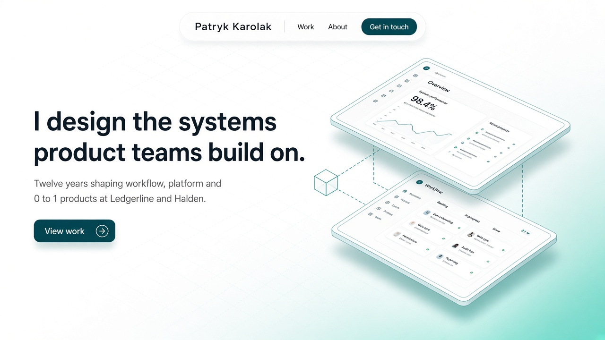
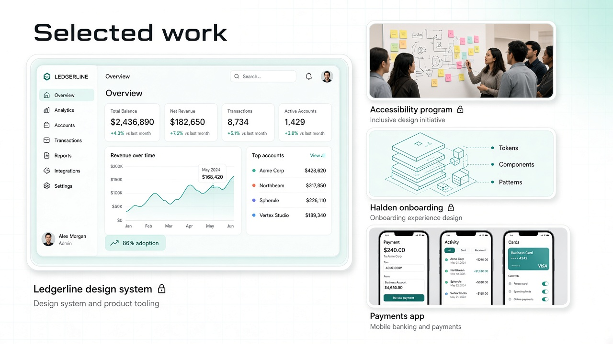
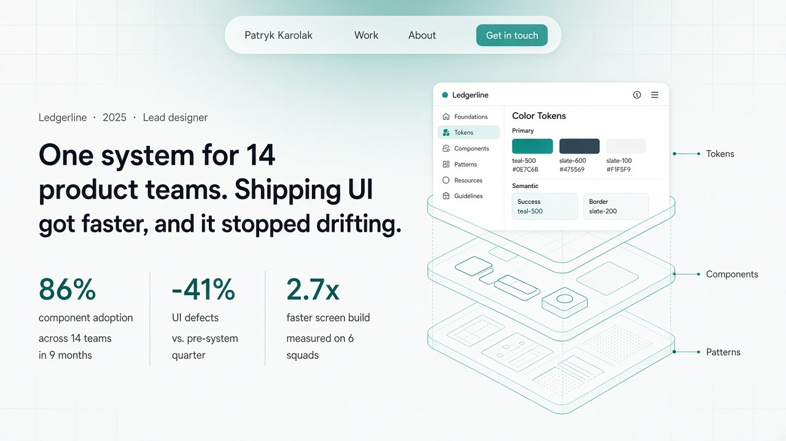
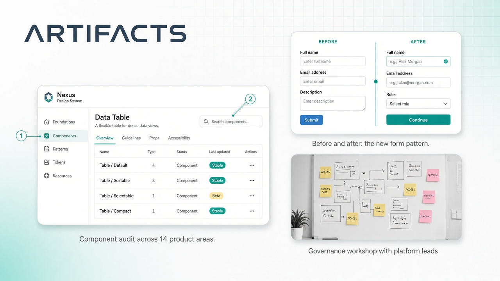

# Phase 0, round 3: Blueprint refined

**Brief from the user, after [round 2](../round-2/README.md):**
- G Blueprint is the favourite, but it should be more modern and leave room for more asset types (screenshots, images).
- Bring back the floating pill nav from round 1 A and mash it up with Blueprint.
- Use Lato as the content font, plus a matching heading font for identity.

**What changed from G**
- **Nav:** a floating frosted-glass pill nav from A, with "Get in touch" as a small teal pill inside it.
- **Frames:** double-bezel frames from A on every media asset, with teal-tinted soft shadows.
- **Isometric perspective:** used for real screenshots too, as exploded "plates" joined by dashed guide lines, not just for line drawings.
- **Bento:** mixed media, with one lead case and 3 companions, each showing a different asset type.

Generated 2026-09-30 with `imagegen-frontend-web`. Typefaces in these images are approximate, because image models do not render fonts faithfully. The real fonts are compared in [../../fonts/specimen.png](../../fonts/specimen.png).

## Hero

## Selected work (mixed asset types)

## Case study header and metrics

## Case study artifacts

## Asset types the design supports

Each is a `kind` in the content schema, so every case can mix them:

- `screenshot`: desktop UI in a double-bezel frame, with optional numbered annotations.
- `isometric`: one or more screenshots as exploded isometric plates with guide lines (hero, case header).
- `mobile`: a set of 2 to 4 phone screens side by side.
- `photo`: documentary photos (workshops, research), slightly desaturated to sit in the palette.
- `diagram`: isometric line illustrations (SVG) in the accent color.
- `compare`: a before/after slider.
- `video`: short muted loops (MP4/WebM) of prototypes or interactions, with a poster image.

## Notes for implementation

- The uppercase wide "ARTIFACTS" heading in the artifacts image is an image-model artifact. Section headings use the heading font in sentence case, and the eyebrow limit still applies.
- The grid and the glow are pure CSS, as shown in [../../fonts/specimen.html](../../fonts/specimen.html): three repeating linear gradients at 30, 150 and 90 degrees, with a radial mask and one radial glow.
