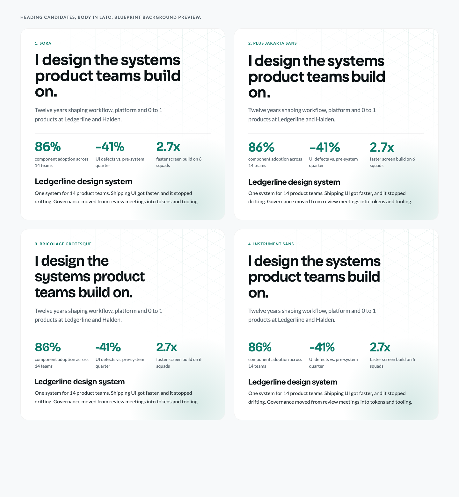

# Font candidates

The body font is **Lato** (user requirement). Four heading candidates are rendered with real fonts over the Blueprint background. Open [specimen.html](specimen.html) in a browser, or see the screenshot:

1. **Sora:** geometric with slightly wide letterforms, precise and technical. The best fit for the isometric and blueprint look.
2. **Plus Jakarta Sans:** friendly and modern, with a softer identity.
3. **Bricolage Grotesque:** the most character (optical sizes, slightly quirky shapes) and the most distinctive identity.
4. **Instrument Sans:** neutral and refined; the least distinctive.

All four are on Google Fonts and load via `next/font/google`. The pick is recorded in `DESIGN.md` and ADR 0002.
