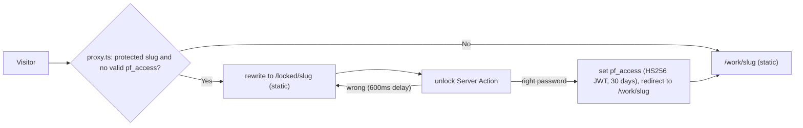

# Architecture

Next.js 16 (App Router, Turbopack), React 19, Tailwind CSS v4, Motion, TypeScript strict, pnpm. Every route is prerendered; the only per-request code is `proxy.ts`.

## Layers

| Layer | Folder | Knows about |
| --- | --- | --- |
| Content | `content/` | Words, numbers, image paths. Validated by `content/schema.ts` at build time. |
| Structure | `app/`, `components/` | Routes, layout grids, behaviour, accessibility. Uses only theme contract names. |
| Design language | `themes/<name>/` | Every visual value and the signature components. See [theming.md](theming.md). |
| Access | `proxy.ts`, `lib/access.ts`, `app/locked/` | Who may see protected cases. See [ADR 0004](decisions/0004-password-gating.md). |

## Routes

| Route | Rendering | Notes |
| --- | --- | --- |
| `/` | static | Blocks: intro hero, card hand, then the chapters (the short version, the big ones, side quests, office hours, off the clock), word of mouth, letter. The docked mini-hand and the card flight layer. |
| `/work` | static | "All the big ones": every case's cover row. 404 while home shows them all. |
| `/about` | static | Blocks: story with education, journey, values, contact. |
| `/kit` | static, `noindex` | Every block and primitive, filled from `content/kit.ts`. Not linked and not in the sitemap. |
| `/work/[slug]` | static (SSG) | Full case. For protected cases the proxy serves `/locked/[slug]` instead until unlocked. |
| `/locked/[slug]` | static (SSG), protected slugs only | Public teaser: title, bottom line, lead metric, cover, unlock form. |
| `/work/[slug]/opengraph-image`, `/opengraph-image` | static | Built with `next/og`, colors and font from `@theme/meta`. Public fields only. |
| `/sitemap.xml`, `/robots.txt` | static | Robots disallows `/locked/` and `/media/protected/`. |

The root layout renders `Atmosphere`, `Nav`, the page, `Footer`, the `CommandMenu` and the `Toaster` region. Each page renders its own contact block with id `contact` (Home: `LetterCard`; other pages: `Contact`), so every "Say hi" link is `#contact`. Each page wraps its content in `PageTransition`, so links tagged `nav-forward` or `nav-back` slide, and a case cover morphs from the work list into the case header (`CoverMorph`, a shared `ViewTransition` name per slug). An inline script adds `js` to `<html>` before paint; without it, CSS shows every reveal immediately, so the site reads without JavaScript.

## Gating flow

## Components

- `components/blocks/`: the block library ([ADR 0010](decisions/0010-block-library.md)). One block per file, each takes its content slice and returns `null` when empty. `HomeBlocks` and `AboutBlocks` are the page compositions; `lib/blocks.ts` hides cards whose target is empty and gives each block its card's suit. `CardHand` fans the chapter cards on wide screens, and a picked card flies to its chapter's emblem (`flight.tsx`, `ChapterHeader.tsx`, [ADR 0032](decisions/0032-card-led-page-nav.md)) ([ADR 0012](decisions/0012-card-hand-and-suits.md)), drawn as real playing cards ([ADR 0013](decisions/0013-real-playing-cards.md)).
- `components/ui/`: primitives. `SmartLink` (anchor, external or app route with a transition type), `ArrowLink`, `Modal` (native `<dialog>`, sheet or palette placement, optional `layoutId` morph), `Panel` and `Frame` (surfaces, take a `rise` index), `Button` (`PrimaryLink`, `PrimaryButton`, both with a `compact` size; the only primary style), `Chip` (static status only), `Icon`, `MetricsPanel`, `Emphasis` (`*word*` becomes the heading's one emphasised word).
- `components/motion/Rise.tsx`: the entry reveal, timings from `@theme/motion`. Clears its filter on completion so it never becomes a backdrop root.
- `components/media/`: `Asset` renders any content asset by `kind`, `Picture` (light and dark sources, unoptimized for protected media), `Compare`, `Video`.
- `components/motion/PageTransition.tsx`: `PageTransition` and `CoverMorph`, built on React's `ViewTransition`; the animations live in the theme CSS.
- `components/site/`: `Nav` (pill nav, command menu button, mobile sheet), `ThemeToggle`, `ThemeProvider` (`next-themes`, `data-theme`, default from `meta.defaultMode`, `MotionConfig reducedMotion="user"`), `CommandMenu` (Cmd K or Ctrl K, combobox and listbox), `Toaster` (`useToast`, polite live region), `CopyEmail`, `Contact`, `Footer`.
- `components/case/`: case page sections. `components/kit/`: the primitives specimen for `/kit`.

## Scripts

- `scripts/theme-check.mjs`, `theme-use.mjs`, `theme-new.mjs`: the design-language tooling.
- `scripts/shots.mjs`: Playwright screenshots of every page (including `/kit`), light and dark, desktop and mobile, including a real unlock. Sets the theme through `localStorage`, since a design language may default to dark. Fails on horizontal overflow.
