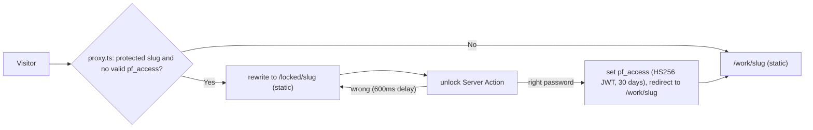

# Architecture

Next.js 16 (App Router, Turbopack), React 19, Tailwind CSS v4, Motion, TypeScript strict, pnpm. Every route is prerendered; the only per-request code is `proxy.ts`.

## Layers

| Layer | Folder | Knows about |
| --- | --- | --- |
| Content | `content/` | Words, numbers, image paths. Validated by `content/schema.ts` at build time. |
| Structure | `app/`, `components/` | Routes, layout grids, behaviour, accessibility. Uses only theme contract names. |
| Design language | `themes/<name>/` | Every visual value and the signature components. See [theming.md](theming.md). |
| Access | `proxy.ts`, `lib/access.ts`, `app/locked/` | Who may see protected cases. See [ADR 0004](decisions/0004-password-gating.md). |

## Routes

| Route | Rendering | Notes |
| --- | --- | --- |
| `/` | static | Hero, selected work (4-cell bento), approach. |
| `/about` | static | Bio, portrait, experience, principles (long form). |
| `/work/[slug]` | static (SSG) | Full case. For protected cases the proxy serves `/locked/[slug]` instead until unlocked. |
| `/locked/[slug]` | static (SSG), protected slugs only | Public teaser: title, bottom line, lead metric, cover, unlock form. |
| `/work/[slug]/opengraph-image`, `/opengraph-image` | static | Built with `next/og`, colors and font from `@theme/meta`. Public fields only. |
| `/sitemap.xml`, `/robots.txt` | static | Robots disallows `/locked/` and `/media/protected/`. |

The root layout renders `Atmosphere`, `Nav`, the page, `Contact` (id `contact`, so every "Get in touch" link is `#contact`) and `Footer`.

## Gating flow

## Components

- `components/ui/`: primitives. `Panel` and `Frame` (surfaces, take a `rise` index), `Button` (`PrimaryLink`, `PrimaryButton`, `ctaPill`), `Chip`, `Icon`, `MetricsPanel`, `Emphasis` (`*word*` becomes the heading's one emphasised word).
- `components/motion/Rise.tsx`: the entry reveal, timings from `@theme/motion`. Clears its filter on completion so it never becomes a backdrop root.
- `components/media/`: `Asset` renders any content asset by `kind`, `Picture` (light and dark sources, unoptimized for protected media), `Compare`, `Video`.
- `components/site/`: `Nav` (pill nav, mobile sheet), `ThemeToggle`, `ThemeProvider` (`next-themes`, `data-theme`), `Contact`, `Footer`.
- `components/home/`, `components/case/`: page sections.

## Scripts

- `scripts/theme-check.mjs`, `theme-use.mjs`, `theme-new.mjs`: the design-language tooling.
- `scripts/shots.mjs`: Playwright screenshots of every page, light and dark, desktop and mobile, including a real unlock. Fails on horizontal overflow.
