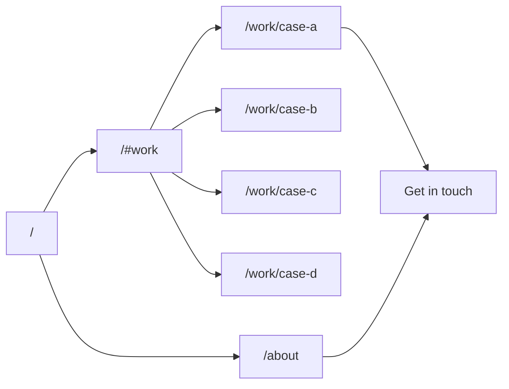
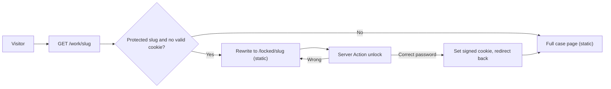

# Product Designer Portfolio Template: Plan

> Source of truth for scope and sequence. Status lives in [progress.md](progress.md). Changes to decisions go through [decisions/](decisions/).

**Design read:** Solo product-designer portfolio for design leaders, hiring managers and cross-functional peers. It has to read as "clearly very strong" within seconds, on a phone or in a shared Slack link, without explaining itself. Visual language is picked from 5 directions below before any code is written.

**Skills in force**
- [design-taste-frontend](../.agents/skills/design-taste-frontend/SKILL.md): brief read, dials, stack, anti-slop rules, final pre-flight checklist.
- [imagegen-frontend-web](../.agents/skills/imagegen-frontend-web/SKILL.md) and [image-to-code](../.agents/skills/image-to-code/SKILL.md): image-first workflow. Concepts are generated, compared and analysed before implementation.
- [stitch-design-taste](../.agents/skills/stitch-design-taste/SKILL.md): writes the locked `DESIGN.md` for the chosen direction.
- One direction skill, depending on the pick (see Phase 0).
- [full-output-enforcement](../.agents/skills/full-output-enforcement/SKILL.md): no stubs or placeholder components.

---

## Phase 0: Style direction gate

> **Locked 2026-09-30: "Blueprint".** It was reached in 3 rounds, plus a font pick (Sora with Lato) and an accent pick (Blueprint Cobalt, light and dark). See [DESIGN.md](../DESIGN.md) and [ADR 0002](decisions/0002-style-direction.md). The round 1 directions below are kept for history.

Goal: choose a look from real visuals, not adjectives. No app code is written in this phase.

**Process**
1. For each direction, generate 2 horizontal reference images with the `GenerateImage` tool, following imagegen-frontend-web (one image per section): **Home hero** and **Case study metrics block**. The same placeholder designer and project are used across all 5 so only the style differs. That makes 10 images.
2. Save to `design/directions/<direction-id>/hero.jpg` and `metrics.jpg`.
3. Present them side by side, with a 3-line summary each: what it signals, what it risks, motion cost.
4. You pick one direction. You can also ask for one tweak, like "B with A's motion."
5. Lock it: write `DESIGN.md` at the repo root with stitch-design-taste. It holds palette tokens, type scale, radius system, spacing, motion curves, dials and banned patterns. Every later step reads from it.

**The 5 directions**

**A. Quiet Precision** (high-end-visual-design, Soft Structuralism)
- Cool silver-grey canvas (`#F4F4F5`), zinc-900 text, one muted cobalt accent.
- Type: Geist Sans display plus Geist Mono for metrics.
- Surfaces: floating island nav, double-bezel frames on project media only, very diffuse shadows, pill CTAs with nested arrow.
- Motion: heavy spring fade-ups, magnetic hover. Dials 7 / 6 / 3.
- Signals: calm authority, Apple or Linear level craft. Risk: can feel familiar if the imagery is weak.

**B. Swiss Systems** (industrial-brutalist-ui, Swiss Industrial Print mode only, no CRT effects)
- Cool newsprint grey (`#EDEDEB`), near-black ink, one signal-red accent.
- Type: heavy grotesk display (Archivo, variable) plus JetBrains Mono for data.
- Surfaces: visible hairline 12-column grid, zero radius, oversized metric numerals. The project index is a precise list with hover image preview.
- Motion: minimal, snap-precise reveals. Dials 7 / 4 / 4.
- Signals: systems thinking and rigor, closest to a design lead's mindset. Risk: austere for non-designers.

**C. Studio Night** (gpt-taste, cinematic)
- Graphite (`#0E0F11`) canvas, never purple. Warm off-white text, one signal-orange accent.
- Type: Cabinet Grotesk display plus Geist Mono.
- Surfaces: full-bleed, media-led project covers. Work section uses a GSAP pinned card stack. Approach uses scrubbed text reveal.
- Motion: highest, adds `gsap` + `@gsap/react`. Dials 8 / 8 / 3.
- Signals: cool, confident, award-site energy. Risk: heavier on mobile, and the style can upstage the work.

**D. Working Notes** (minimalist-ui, document style)
- Pure white, charcoal `#111111` text, muted pastel tags. Uses no cream and no serif.
- Type: Geist Sans plus Geist Mono, 8px radius, 1px `#EAEAEA` borders.
- Surfaces: flat asymmetric bento, UI artifacts framed in minimal window chrome, `kbd` micro details.
- Motion: near invisible, 600ms fades. Dials 6 / 3 / 4.
- Signals: product clarity; reads like a spec from a great designer. Most legible for any audience. Risk: least "cool."

**E. Signal** (design-taste-frontend kinetic type, monochrome plus one pop)
- Off-white and off-black, one saturated ultramarine accent used sparingly.
- Type: Satoshi display, very large. The hero headline has small inline image pills showing project covers.
- Surfaces: type-led, a single outcomes marquee, sharp image crops.
- Motion: scroll-driven type and cover reveals with Motion `useScroll`. Dials 9 / 7 / 3.
- Signals: memorable, has a point of view. Risk: personality-forward; needs strong copy.

**Constants across every direction**
- Single theme per page, one accent, one radius system.
- No em-dashes in UI copy.
- Max one eyebrow per 3 sections.
- No centered SaaS hero, no locale or time strips, no scroll cues, no section numbering.

---

## Tech stack (Vercel-native)

- **Framework:** Next.js latest stable via `create-next-app@latest`, App Router, React Server Components by default, TypeScript strict, pnpm.
- **Styling:** Tailwind CSS v4 (`@tailwindcss/postcss`), tokens as CSS variables generated from `DESIGN.md`.
- **Motion:** `motion/react` in isolated `'use client'` leaf components. No GSAP.
- **Fonts:** `next/font/google`, with Sora (500, 600) for headings and Lato (400, 700, 400 italic) for body. Inter is never used.
- **Theming:** `next-themes` (`attribute="data-theme"`), light and dark following the system, with a toggle in the nav.
- **Visual fidelity:** Playwright (`pnpm shots`) captures pages into `design/shots/` for comparison with `design/preview/blueprint.png` (DESIGN.md section 11).
- **Icons:** `lucide-react`, `strokeWidth` 1.5 (ADR 0007).
- **Content:** typed modules in `content/`, validated with `zod` at build time.
- **Images:** `next/image` (AVIF/WebP), assets in `public/projects/<slug>/`.
- **Rendering:** all routes static (`generateStaticParams` for cases).
- **Vercel:** `@vercel/analytics` + `@vercel/speed-insights`, zero-config deploy.

---

## Information architecture



- **Nav:** Work, About, Get in touch. Nav height is at most 72px and fits on one line.
- **One label per intent across the whole site:** "View work" (portfolio intent), "Get in touch" (go to the contact block) and "Email me" (the contact block's mail action). One label never means two actions.
- **Contact:** `mailto:` plus LinkedIn and a calendar link from `site.ts`. No backend.

---

## Content model (teaser depth, enforced)

A zod schema in `content/schema.ts` fails the build if a case exceeds its reading budget. That keeps the template from turning into long essays when real content is swapped in.

**Project fields**
- `slug`, `title`, `company`, `year`
- `bottomLine`: at most 30 words. What changed and why it mattered. This is the only thing a busy reader must see.
- `role`, `team` (e.g. "2 PMs, 9 engineers, 1 researcher"), `timeline`
- `metrics[]`: 2 to 3 items, each `{ value, label, context }`. `context` gives the baseline or time window (e.g. "vs. Q1 baseline, 8 weeks post-launch") so the numbers are credible, not just big.
- `scope[]`: 2 to 3 areas, e.g. "Design system", "Onboarding", "Pricing", shown as labelled text. Shows breadth.
- `partners`: one line on who they worked with and led across functions.
- `beats`: exactly 3, `{ label, text }`, where `text` is at most 25 words (Frame, Shape, Ship).
- `artifacts[]`: 2 to 4 items, each `{ kind, src, alt, caption }`. `alt` is required. The `kind` is one of:
  - `screenshot`, with optional annotations.
  - `isometric`: exploded screenshot plates.
  - `mobile`: 2 to 4 phone screens.
  - `photo`
  - `diagram`: an SVG line illustration.
  - `compare`: before and after.
  - `video`: a muted loop with a poster.

  See [design/directions/round-3/README.md](../design/directions/round-3/README.md).
- `askMeAbout[]`: 2 to 3 prompts, e.g. "Why we killed the wizard two weeks before launch". This is the hook for the in-person story. It signals depth without writing it out.
- `access`: `"protected"` (default) or `"public"`. See Password gating.
- `cover`: `{ kind, src, alt }`, using the same kinds, so the home bento can mix screenshots, photos, diagrams and phone sets.
- `accent?` (must be a token from `DESIGN.md`, no free colors)

**Placeholder designer name:** Patryk Karolak, used in `content/site.ts`, in metadata and OG images, and in all design references from `section-refs` on. Round 1 and round 2 concepts show an older placeholder, Maren Kowal.

**Site fields** (`content/site.ts`): name, title, one-line positioning, short bio, portrait, experience list (role, company, years), 3 working principles, links.

**The 4 placeholder cases**
Each placeholder case shows a different kind of senior signal:
1. **Design system adoption at scale:** platform leverage, influence without authority.
2. **Core workflow redesign:** measurable efficiency, hard tradeoffs.
3. **0 to 1 product bet:** ambiguity, research to launch, business framing.
4. **Cross-org initiative (accessibility program):** multi-team leadership, standards.

**Copy rules**
- The designer is Patryk Karolak. Companies, colleagues and projects are realistic but fictional; no Acme or Jane Doe.
- No "elevate / seamless / passionate." No em-dashes.
- Never frame the site around career level, titles or job moves. The work speaks; the site never asks for anything.

---

## Page compositions

> **Superseded for Home and About (round 8, [ADR 0010](decisions/0010-block-library.md)).** Home and About are now composed from the block library in `components/blocks/`:
> - **Home (since the "Clear IA and card nav" plan, [ADR 0031](decisions/0031-chapters-and-names.md), [ADR 0032](decisions/0032-card-led-page-nav.md)):** IntroHero, CardHand as the table of contents, then five chapters, one per card: Statement ("The short version"), WorkTimeline ("The big ones", 3 featured, the rest on `/work`), Showcase ("Side quests"), Teaching ("Office hours"), OutsideWork ("Off the clock"). Then Testimonials ("Word of mouth"), LetterCard (id `letter`) and ContactForm ("Drop me a line", id `contact`, [ADR 0033](decisions/0033-contact-form.md)). A picked card flies to its chapter; HandDock keeps the hand docked at the bottom while reading. WritingList and the card zoom overlay are gone.
> - **`/work`:** "All the big ones", every case, only while home cannot show them all.
> - **About** no longer carries OutsideWork; it moved to Home as My world.
> - **About ("The long version"):** StoryHeader with the optional CV button and Education ("School days"), Journey ("Where I've been"), Values ("How I work"), Contact.
> - Every block renders nothing when its content is empty; `/kit` shows all of them filled from `content/kit.ts`. App primitives: Modal (sheet and palette), Toaster, CommandMenu (Cmd K), `press`, and view transitions between routes with a cover morph into the case header.
> - The case, locked and 404 compositions below still apply. The original Home and About specs are kept for history.

### Home (4 sections, 4 different layout families)
1. **Hero.** At most 4 text elements: name, positioning line (at most 2 lines), one supporting sentence (at most 20 words), "View work." Fits the viewport, top padding at most `pt-24`.
2. **Selected work.** Asymmetric layout with exactly 4 cells: one lead case plus three companions. Each cell shows the cover, title and `bottomLine`. The lead case also shows its strongest metric. Hover reveals the arrow and a gentle media scale.
3. **Approach.** 3 working principles as a typographic list, not cards. Each is one sentence tied to evidence ("see Case B").
4. **Contact.** One large "Get in touch" moment, links, and a quiet footer.

### Case study `/work/[slug]` (target: understood in 30 seconds, at most about 2 screens)
1. Title, company, year, and `bottomLine` as the largest text on the page.
2. Metrics band (2 to 3 values with context lines). This is the primary strength surface.
3. Role, team, timeline, partners and scope, each labelled, in one compact block.
4. Three beats as a horizontal row on desktop, stacked on mobile.
5. Artifacts: 2 to 3 large frames with captions.
6. **Ask me about:** 2 to 3 prompts plus "Get in touch." The page ends by inviting the conversation.
7. Next case link.

### Locked case `/work/[slug]` (not unlocked yet)
> **Updated (round 8):** a centred card with a lock character whose keyhole eyes follow the pointer, look at the password field on focus, shut while typing and shake on a wrong password (`components/case/LockFace.tsx`). "Password, please.", the case title and company, the stacked unlock form and "Ask me for one". Below the card: the bottom line (so anyone still gets it) and links to the open cases. The cover and lead metric moved off this page. The points below still hold otherwise.
- Shows the cover, title, company, year, `bottomLine` and the single lead metric. Anyone still gets the bottom line.
- Unlock form below: one password field with a visible label, a submit button ("Unlock"), and an inline error on a wrong password.
- A second line: "No password? Ask me for one", then links to the open cases.
- Designed in the chosen direction as a real page, not a browser prompt or a generic modal.
- Home cards for protected cases show a small Lucide `Lock` icon next to the title. No other change.

### About
Portrait and bio (at most 80 words), experience list, principles (same data as the home Approach section, shown longer), "Get in touch."

---

## Password gating

The home page and About are public. Each case defaults to protected. One shared password unlocks every protected case for 30 days. A template user can set `access: "public"` per case.



**Mechanism**
- **Env vars:**
  - `CASE_PASSWORD` is the shared password.
  - `AUTH_SECRET` is at least 32 random bytes, used for signing.
  - Both are set in Vercel project settings and documented in `.env.example`.
- **Unlock** (`app/locked/[slug]/actions.ts`, a Server Action):
  - Compares the submitted password with a constant-time compare.
  - On success, sets cookie `pf_access`: HttpOnly, Secure, SameSite=Lax, Path `/`, 30-day max age.
  - The cookie value is a token signed with `jose` (HS256) that carries the expiry.
  - Then redirects back to `/work/[slug]`.
- **Middleware / proxy** (Next.js request interception file; `proxy.ts` on Next.js 16+):
  - Matches `/work/:slug*` and `/media/protected/:path*`.
  - Verifies the token at the edge. If it is missing or invalid:
    - Case routes rewrite to `/locked/[slug]`, so the URL stays shareable.
    - Media requests return 401.
- **Pages stay static.** The full case page and the locked page are both prebuilt; only the middleware decides which one is served. No case content ships in the locked page HTML.
- **Protected media:**
  - Artifacts for protected cases live in `public/media/protected/<slug>/`, behind the middleware.
  - They render with `next/image unoptimized`, because the image optimizer does not forward cookies. The files are pre-exported as AVIF/WebP at sensible sizes.
  - Covers stay public, since the locked page shows them.
- **Leak prevention:**
  - OG images for protected cases use only the title, bottom line and cover.
  - Full case pages send `robots: noindex`.
  - The sitemap lists only public routes and locked pages.
- **Brute force:**
  - A fixed 600ms delay on failed attempts.
  - A Vercel Firewall rate-limit rule on POSTs to `/locked/*` (10 per minute per IP), with setup steps in the README.
- **Lock again:** a small "Lock cases" link in the footer, shown only when unlocked, clears the cookie.

**Honest limit:** this is meant to keep content out of public view and search engines, not to protect secrets. Anyone given the password can share it. The README says so.

---

## Project structure

```
/
├── AGENTS.md                    # entry point for any agent
├── CLAUDE.md                    # "@AGENTS.md" only
├── DESIGN.md                    # locked design system from Phase 0
├── docs/                        # hub, plan, progress, ADRs (see Documentation)
├── design/directions/           # Phase 0 concept images (kept for reference)
├── design/refs/                 # Phase 1 section references for chosen direction
├── app/
│   ├── layout.tsx               # fonts, tokens, analytics
│   ├── page.tsx
│   ├── about/page.tsx
│   ├── work/[slug]/page.tsx
│   ├── work/[slug]/opengraph-image.tsx
│   ├── locked/[slug]/page.tsx   # public teaser + unlock form
│   ├── locked/[slug]/actions.ts # unlock / lock Server Actions
│   ├── opengraph-image.tsx
│   ├── sitemap.ts, robots.ts
│   └── globals.css              # Tailwind v4, imports the active theme, maps contract tokens
├── components/
│   ├── site/  (Nav, ThemeToggle, Footer, Contact)
│   ├── home/  (Hero, WorkCard, SelectedWork, Approach)
│   ├── case/  (CaseHeader, CaseFacts, Beats, Artifacts, AskMeAbout, NextCase, UnlockForm)
│   ├── media/ (Asset, Picture, Compare, Video)
│   ├── motion/ (Rise)
│   └── ui/    (Button, Chip, Frame, Panel, Icon, MetricsPanel, Emphasis)
├── themes/                      # design language layer, see docs/theming.md
│   ├── contract.json, contract.ts
│   └── blueprint/  (theme.css, fonts, motion, icons, meta, Atmosphere, Signature, Diagram)
├── scripts/  (theme-check, theme-new, theme-use, shots)
├── content/  (schema.ts, site.ts, projects/<slug>.ts)
├── lib/access.ts                # sign / verify token (jose), constant-time compare
├── proxy.ts                     # request interception (middleware.ts on older Next.js)
├── .env.example                 # CASE_PASSWORD, AUTH_SECRET
├── public/projects/<slug>/      # public covers
├── public/media/protected/<slug>/ # gated artifacts
└── README.md                    # swap content, images, deploy
```

---

## How strength shows (without saying it)

- **Impact:** metrics with baselines, placed first on every case.
- **Scope:** scope chips, team size and partners show the size of the problems.
- **Range:** the 4 cases each carry a different senior signal (systems, execution, ambiguity, org leadership).
- **Craft:** large real artifacts, and the site itself is the craft proof.
- **Judgment:** strict brevity and "Ask me about" prompts imply there is much more depth.
- **Discretion:** gated cases read as real, sensitive work that is shared deliberately, which also signals seniority.
- **Avoided:** self-praise adjectives, testimonial carousels, award walls, skill bars, tool logo grids.

---

## Repository and workflow

**Remote:** [pkarolak/productdesign](https://github.com/pkarolak/productdesign) (private).

**Setup (done 2026-09-30)**
1. `git branch -m master main`
2. Add `.gitignore`: `node_modules/`, `.next/`, `.vercel/`, `.env*` except `.env.example`, `.DS_Store`, `*.tsbuildinfo`.
3. `git remote add origin https://github.com/pkarolak/productdesign.git`
4. First commit: `.gitignore`, `.agents/skills/`, `skills-lock.json` with message `chore: init repo with taste skills`.
5. `git push -u origin main`

**Working rules**
- **Branch:** work on `main`. Commit after every completed todo and push right away, so the remote is always the handoff point, not the local machine.
- **Commit messages:** conventional (`feat`, `fix`, `docs`, `chore`, `design`), with the scope named (`feat(gate): unlock server action`).
- **Secrets:** never commit them. `CASE_PASSWORD` and `AUTH_SECRET` live only in Vercel env settings and a local `.env.local` (gitignored). `.env.example` holds names only.
- **Vercel:** during the scaffold step, the GitHub repo is imported into Vercel with the Next.js preset. Every push to `main` deploys to production, and other branches get preview URLs. Env vars are set for Production and Preview before the gating todo is tested.
- **Private repo:** this protects the docs and design artifacts. The site's password gating still has to work on its own, because the deployed site is public.

---

## Documentation and agent handoff

Goal: a new agent (or person) can clone the repo, read one file, and continue the work with no chat history. Everything that matters lives in git, not in agent-specific places. This plan lives in `.cursor/plans/`, outside the repo, so it is copied into `docs/plan.md`.

**Entry point for any agent: `AGENTS.md`** (the cross-tool convention read by Cursor, Codex, Claude Code and others).
- What this project is and who it is for, in 5 lines.
- Current phase and the next task, pointing to `docs/progress.md`.
- Commands: install, dev, build, lint, typecheck, content check, docs check.
- Repo: remote `origin` is `pkarolak/productdesign`, branch `main`. Commit and push after every todo; never commit secrets.
- Hard rules:
  - Read `DESIGN.md` before any UI work.
  - Load the listed skills from `.agents/skills/`; reinstall with `npx skills add Leonxlnx/taste-skill`, pinned by `skills-lock.json`.
  - Respect the content budgets.
  - Never frame site copy around career level, titles or job moves.
  - No em-dashes in UI copy.
  - Gated media only goes under `public/media/protected/`.
- Map of where things live, with links into `docs/`.
- **Session protocol:** start by reading `docs/progress.md`. End by updating it, adding an ADR for any new decision, and committing.
- `CLAUDE.md` contains only `@AGENTS.md`, so Claude Code loads the same source. There are no duplicate instruction files.

**`docs/` structure** (hub and spoke; each fact defined once and linked everywhere else)
```
docs/
├── README.md            # navigation hub
├── plan.md              # this plan, kept in sync as it changes
├── progress.md          # status log and handoff (see below)
├── brief.md             # audience, goals, strength signals, teaser philosophy
├── architecture.md      # routes, rendering, gating flow, content pipeline, diagrams
├── content-guide.md     # how to write a case within budgets, image specs, swapping placeholders
├── operations.md        # env vars, Vercel deploy, Firewall rule, rotating the password
└── decisions/
    ├── 0000-template.md
    ├── 0001-stack.md
    ├── 0002-style-direction.md   # chosen direction + rejected ones, linking design/directions/ images
    ├── 0003-teaser-depth-and-content-budgets.md
    ├── 0004-password-gating.md   # mechanism, threat model, known limits
    └── 0005-image-first-design-workflow.md
```

**`docs/progress.md` format.** Newest entry on top. Each entry records:
- Date and agent/model.
- Phase and todo IDs touched.
- Done.
- In progress, with the exact file or step it stopped at.
- Next step.
- Open questions and known issues.

The todo list from this plan is mirrored at the top as a checklist, so status is visible without tooling.

**ADR format** (`docs/decisions/0000-template.md`): Context, Decision, Alternatives considered, Consequences, Status (Proposed / Accepted / Superseded by NNNN). A decision changes by adding a new ADR, never by editing history.

**Other handoff guarantees**
- **Design artifacts are in the repo:** `design/directions/` (Phase 0 concepts), `design/refs/` (section references) and `DESIGN.md`, each referenced from ADR 0002.
- **Commits:** one commit per completed todo, with conventional messages (`feat(case): metrics band`, `docs(adr): 0004 password gating`). Git history then reads as a changelog.
- **Code comments:** only for constraints the code cannot show (e.g. why protected images are `unoptimized`). The explanations live in the docs.
- **Wording:** repo docs describe the goal as "showcase senior-level strength" and nothing more specific, in case the repo is ever shared.
- **Docs check:** `pnpm docs:check` runs `markdown-link-check` over `AGENTS.md`, `README.md` and `docs/`, and is part of QA.
- **README.md** stays user-facing (what it is, quick start, customize, deploy) and links into `docs/`. Agent and developer workflow lives in `AGENTS.md` and `docs/`.

---

## Implementation sequence

0. **Repo setup, then docs foundation:**
   - Rename the branch to `main`, add the remote, make the first commit and push.
   - Then `AGENTS.md`, `CLAUDE.md`, the `docs/` skeleton, `docs/plan.md`, `docs/progress.md` and ADR 0001, committed and pushed.
   - Every later step ends with a progress entry, a commit and a push.
1. **Phase 0:** direction concepts, then your pick, then `DESIGN.md` and ADR 0002.
2. **Phase 1:** section references for the chosen direction only (selected work, approach, contact, case page, about), analysed per image-to-code before coding.
3. Scaffold, with tokens and fonts from `DESIGN.md`.
4. Content schema plus placeholder content.
5. Shell (nav, footer, motion primitives).
6. Home, then the case template, then the locked page and gating, then About.
7. Generate covers and artifact frames in the locked palette.
8. Metadata, OG images, sitemap, analytics.
9. QA:
   - Full design-taste-frontend pre-flight checklist, plus the DESIGN.md section 11 fidelity checklist.
   - A `pnpm shots` comparison of every page against the reference, in both themes, at desktop and mobile.
   - Performance check on a mid-range phone: glass and orbs stay smooth (no dropped frames when scrolling the home page).
   - WCAG AA contrast, keyboard and focus states, `prefers-reduced-motion`.
   - Layout checks at 375, 768, 1280 and 1440px.
   - Lighthouse 95 or higher on performance and accessibility; LCP under 2.5s, CLS under 0.1.
   - Gating:
     - Locked page HTML and protected media URLs leak nothing without the cookie.
     - A wrong password shows an inline error.
     - Unlock survives a reload.
     - "Lock cases" works.
     - Public cases bypass the gate.
10. README: how to swap name, cases and images, change the accent, set `CASE_PASSWORD` / `AUTH_SECRET` and the Firewall rule, and deploy to Vercel.
11. Docs final pass:
    - Complete `architecture.md`, `content-guide.md` and `operations.md`.
    - ADRs 0003 to 0005 accepted.
    - `pnpm docs:check` passes.
    - A final handoff entry in `progress.md`.

---

## Out of scope (v1)

- CMS, MDX or blog
- Per-person passwords, accounts or access analytics (one shared password in v1)
- Contact form backend
- Multi-language
