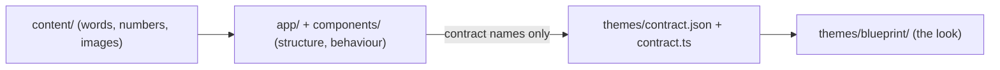

# Changing the design language

The whole look of the site lives in one folder, `themes/<name>/`. The rest of the app never learns which design language it is rendering. The current language is **Blueprint** (`themes/blueprint/`, specified in [DESIGN.md](../DESIGN.md)). Why it is built this way: [ADR 0008](decisions/0008-design-language-layer.md).

## TL;DR

```bash
pnpm theme:new paper      # fork the active theme into themes/paper/
# edit themes/paper/* (see "What a theme owns")
pnpm theme:use paper      # switch both switch points, then run theme:check
pnpm dev                  # look at it
pnpm build                # theme:check runs again before every build
```

Switching back is `pnpm theme:use blueprint`. Keeping several themes side by side is fine; only one is active.

## How it fits together



- **Content** says *what* (copy, metrics, assets).
- **App and components** say *where and how it behaves* (layout grids, routing, gating, a11y). They use contract names like `surface`, `type-h2`, `text-ink-2`, `rounded-frame`, `ease-slow`.
- **The theme** says *what it looks like* by giving those names values and by providing a few signature components.

### The two switch points

| Where | Line |
| --- | --- |
| `tsconfig.json` | `"@theme/*": ["./themes/blueprint/*"]` |
| `app/globals.css` | `@import "../themes/blueprint/theme.css";` |

CSS cannot read a TypeScript alias, so there are two lines. `pnpm theme:use` edits both, and `pnpm theme:check` fails the build if they disagree.

## What a theme owns

The required files and exports are listed in [themes/contract.json](../themes/contract.json). Types live in [themes/contract.ts](../themes/contract.ts).

| File | Owns |
| --- | --- |
| `theme.css` | Every color, shadow, radius, spacing, easing and duration token, for light and dark (`[data-theme="dark"]`). The contract utilities: `surface`, `surface-deep`, `surface-strong`, `surface-sheet`, `media`, `core`, `wash`, `divider`, the `type-*` scale, `focus-ring`, `link`. Anything private (Blueprint's orbs, dot lattice, grain, plate float). |
| `fonts.ts` | The fonts, via `next/font`. Must set `--theme-font-display` and `--theme-font-body`. |
| `motion.ts` | JS motion values: easing, spring, the entry reveal ("rise"), hover and menu timing. Used by `<Rise>`, the nav and the menu. |
| `icons.ts` | The icon library, mapped onto the fixed icon names in `contract.ts`, plus stroke width and sizes. Swap Lucide for anything by changing this one file. |
| `meta.ts` | Plain color values for places that cannot read CSS variables: browser `theme-color` and OG images, plus the OG font family. |
| `Atmosphere.tsx` | The fixed background layer. Blueprint: drifting orbs, dot lattice, grain. Another theme can return a flat color or nothing. |
| `Signature.tsx` | The hero and case-header visual for `isometric` assets. Blueprint: floating glass plates. Another theme might show a single flat frame. |
| `Diagram.tsx` | How `diagram` assets are drawn. Blueprint: isometric stacked layers. |

### What stays the same across themes

Layout grids, the page compositions, content budgets, gating, routes, accessibility behaviour and the asset kinds. If a new language needs a *different structure* (not just a different look), change the components deliberately and add an ADR. That is a redesign, not a theme swap.

## Rules that keep it swappable

`pnpm theme:check` enforces the first three:

1. **App code imports theme modules only via `@theme/*`.** Never `@/themes/blueprint/...`.
2. **App code uses only contract names.** A theme's private classes and variables (Blueprint's `bp-*`, `--glass-*`, `--orb-*`, `--dot`) are rejected outside the theme folder.
3. **Every contract token and utility exists** in the active theme, in light and dark.
4. **No free values in components.** Tailwind's default palette, radii, shadows, fonts and easings are reset in `app/globals.css`, so `bg-blue-500`, `rounded-xl` or `ease-in` simply do not exist. Use `bg-accent`, `rounded-frame`, `ease-slow`. Layout values (grid columns, gaps, max widths) are structure and stay in components.
5. **Glass is a theme decision, not a component decision.** Components ask for a `surface`; Blueprint answers with frosted glass. A flat theme can answer with a solid card and a hairline.
6. **Surfaces rise themselves.** `Panel`, `Frame` and `Signature` take a `rise` index instead of being wrapped in `<Rise>`. In Blueprint this matters because an animating ancestor would flatten the glass; other themes simply get the same API.

## Adding a new contract name

When a component genuinely needs something new (say a `type-quote` style):

1. Add it to every theme's `theme.css` (at least the active one).
2. Add it to `themes/contract.json`.
3. Use it in the component.
4. Document it in the theme's design spec (for Blueprint, `DESIGN.md`).

## Checklist for a new design language

- [ ] `pnpm theme:new <name>` and edit every file in the table above.
- [ ] Write its spec (copy the structure of `DESIGN.md`) and add an ADR.
- [ ] Update `site.ts` copy only if the voice changes; content is theme-independent.
- [ ] `pnpm theme:use <name>`, `pnpm build`, `pnpm start`, then `pnpm shots` and review light, dark, desktop and mobile.
- [ ] Check WCAG AA contrast for body text (4.5:1) and large text (3:1) in both themes.
- [ ] Check `prefers-reduced-motion` and `prefers-reduced-transparency`.
